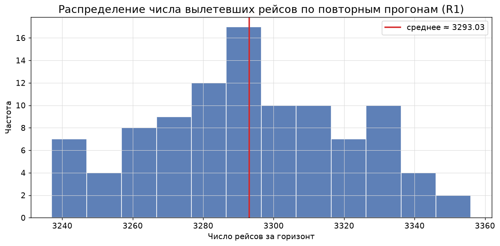
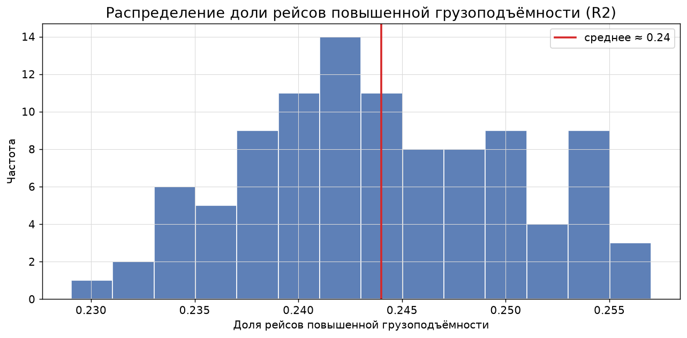
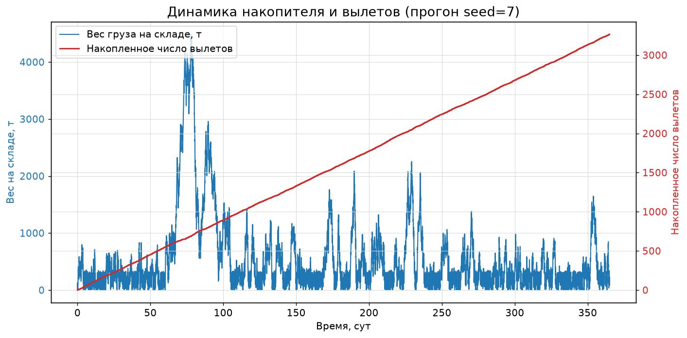
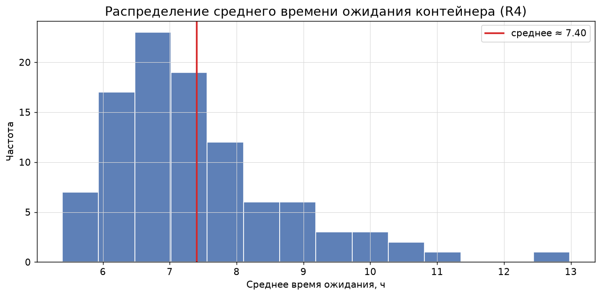
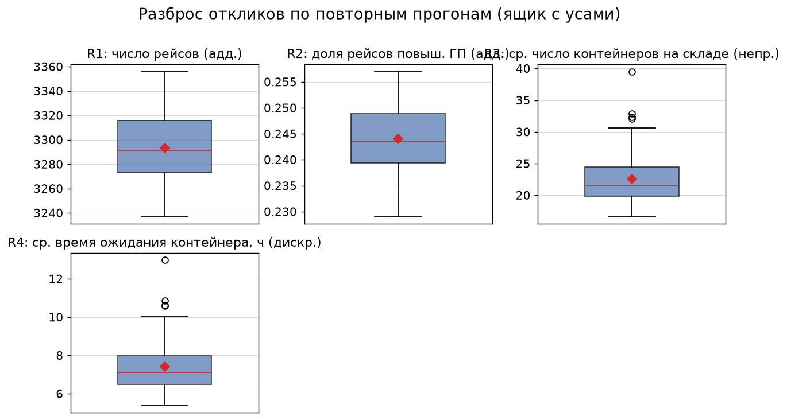
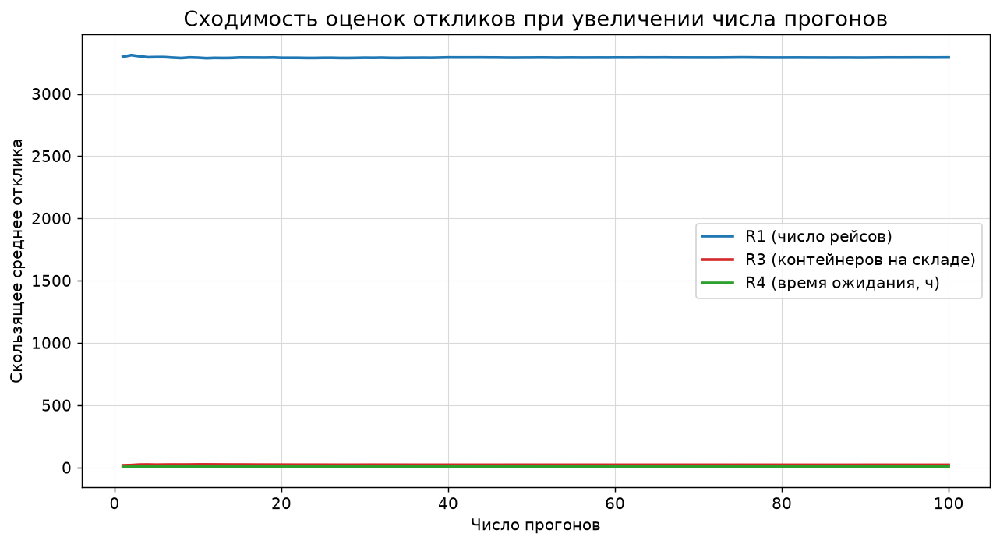
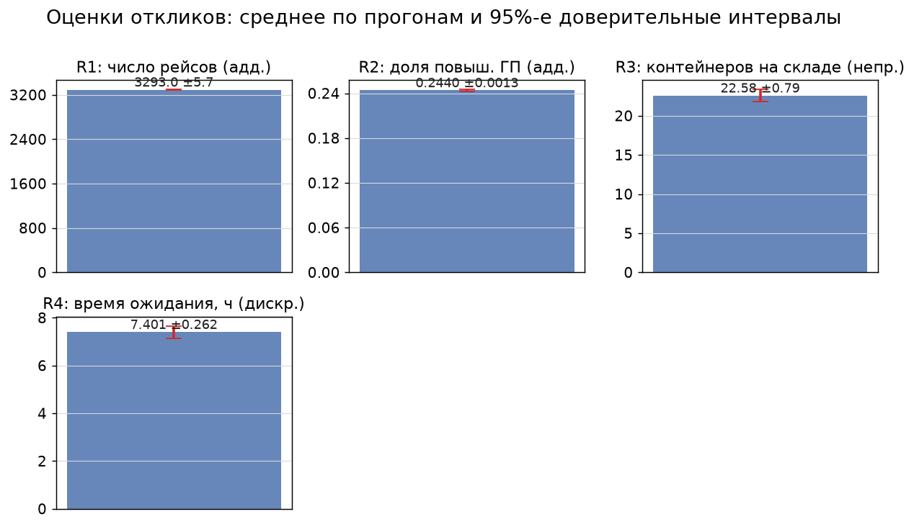
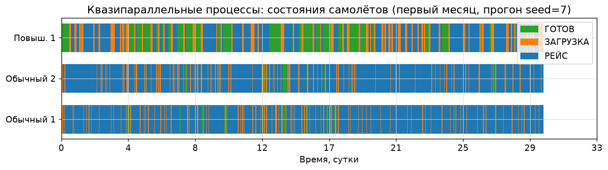

# Отчёт по лабораторной работе
## «Программная имитационная модель сложной системы»
### Вариант №15 — Грузовой аэропорт

---

## 1. Постановка задачи

В грузовой аэропорт прибывают грузы в контейнерах. Самолёты отправляются в
рейс после **полной загрузки**. Используются два типа самолётов: обычной и
повышенной грузоподъёмности. Управляющий аэропортом старается как можно чаще
использовать самолёты обычной грузоподъёмности; самолёты повышенной
грузоподъёмности используются **только при отсутствии обычных**.

> Концептуальная модель приведена в файле **`conceptual_model.md`**
> (согласуется с преподавателем до этапа программирования).

**Цель моделирования** — оценить:

- R1 — число вылетевших рейсов `N_dep` (**аддитивный отклик**, счётчик);
- R2 — доля рейсов повышенной грузоподъёмности `N_dep_h / N_dep` (**аддитивный отклик**);
- R3 — среднее число контейнеров на складе `∫Q(t)dt / T` (**непрерывный отклик**);
- R4 — среднее время ожидания контейнера `Σ w_i / N_loaded` (**дискретный отклик**).

Дополнительно фиксируются суммарный вес вывезенного груза и остаток склада
на момент останова — для внутренней проверки баланса «прибыло = вывезено +
остаток».

---

## 2. Программная реализация

| Файл | Назначение |
|---|---|
| `config.json` | исходные данные модели |
| `simulation.py` | дискретно-событийная имитационная модель (движок + прогоны) |
| `charts.py` | вычисление статистик и построение диаграмм (PNG) |
| `conceptual_model.md` | концептуальная модель |
| `out/results_replications.csv` | результаты повторных прогонов |
| `out/trace_excerpt.txt` | фрагмент режима трассировки |
| `out/fig1…fig8.png` | диаграммы |

**Исходные данные (`config.json`):**

```json
{
  "horizon": 8760.0,
  "arrival_rate": 3.0,
  "weight_min": 10.0,
  "weight_max": 30.0,
  "n_normal": 2,
  "n_high": 1,
  "normal_capacity": 100.0,
  "high_capacity": 300.0,
  "load_time_mean": 0.15,
  "flight_time_mean": 6.0,
  "n_runs": 100
}
```

### 2.1. Механизм продвижения времени

Используется **дискретно-событийный** принцип моделирования с продвижением
времени **по ближайшему событию** (next-event): из календаря событий всегда
берётся событие с минимальным временем, т.е. **постоянный временной шаг не
используется**.

События: `ARRIVAL` (поступление контейнера), `LOAD_STEP` (загрузка одного
контейнера), `RETURN` (возврат самолёта), `END` (конец прогона).

### 2.2. Квазипараллельные процессы

Динамика представлена как взаимодействие **квазипараллельных процессов**:

- `CONTAINER_FLOW` — генератор контейнеров;
- `PLANE_i` — процесс каждого самолёта (ГОТОВ → ЗАГРУЗКА → РЕЙС → ГОТОВ);
- `DISPATCHER` — правило управляющего (назначение самолётов).

Правило управляющего (приоритет обычных):

1. если вес груза на складе ≥ `C_n` и есть свободный обычный самолёт —назначается обычный;
2. иначе, если нет свободных обычных, вес склада ≥ `C_h` и есть свободный повышенной ГП — назначается повышенной ГП;
3. иначе — ожидание накопления груза.

Пример трассы (`out/trace_excerpt.txt`) показывает чередование процессов на
единой временной шкале:

```
t=    0.000 | DISPATCHER       | старт прогона, попытка назначения      | склад[шт]= 0 ... | N0:ГОТОВ N1:ГОТОВ H2:ГОТОВ
t=    0.130 | CONTAINER_FLOW   | поступил контейнер весом 13.0 т        | склад[шт]= 1 ... | N0:ГОТОВ N1:ГОТОВ H2:ГОТОВ
...
t=    0.978 | CONTAINER_FLOW   | поступил контейнер весом 26.5 т        | склад[шт]= 7 вес=119.0 т | N0:ГОТОВ N1:ГОТОВ H2:ГОТОВ
t=    0.978 | PLANE_0          | назначен (normal), 100.0 т             | склад[шт]= 7 ... | N0:ЗАГРУЗКА N1:ГОТОВ H2:ГОТОВ
t=    0.978 | PLANE_0          | взят контейнер на загрузку (0/100)     | ...
```

### 2.3. Генератор случайных чисел

Все случайные потоки моделируются **единственным** встроенным датчиком
`random.Random(seed)` (интервалы поступлений, веса контейнеров, время загрузки и
полёта — экспоненциальные и равномерное распределения). Независимость прогонов
обеспечивается различными начальными номерами `seed = 1…100`.

### 2.4. Режим трассировки

Режим включается флагом `trace` (или ключом `--trace`): в протокол выводятся
все события с указанием **активного процесса**, номера и состояния каждого
самолёта, текущего числа контейнеров и веса груза на складе
(см. фрагмент выше и полную трассу прогона `--trace`).

---

## 3. Верификация модели

### 3.1. Внутренняя согласованность (проверка баланса)

Для каждого прогона контролируется материальный баланс:

```
прибыло тонн = вывезено тонн + остаток склада на момент останова
```

Расхождение этой формулы равно грузу, находящемуся в самолётах в момент
останова (незавершённая загрузка): по 100 прогонам оно не превышало
**264 т** (≤ 0.05 % от прибывшего груза) и было ненулевым лишь в 32
прогонах из 100. С учётом груза в самолётах баланс выполняется точно —
максимальное расхождение **5.8·10⁻⁹ т** (погрешность округления с
плавающей точкой).

### 3.2. Повторные прогоны

Проведён имитационный эксперимент: **N = 100 независимых прогонов** по
`T = 8760 ч` (1 год) каждый. Для каждого отклика вычислены среднее, СКО,
минимум, максимум и 95%-й доверительный интервал `m ± t·s/√N`
(t-распределение, `t₀.₉₅₍₉₉₎ = 1.984`):

| Отклик | Среднее | СКО | Мин | Макс | 95% ДИ ± |
|---|---|---|---|---|---|
| **R1** число рейсов (адд.) | 3293.03 | 28.77 | 3237 | 3356 | 5.72 |
| **R2** доля рейсов повыш. ГП (адд.) | 0.2440 | 0.0064 | 0.229 | 0.257 | 0.0013 |
| **R3** ср. контейнеров на складе (непр.) | 22.58 | 3.99 | 16.62 | 39.53 | 0.79 |
| **R4** ср. время ожидания, ч (дискр.) | 7.40 | 1.32 | 5.39 | 12.98 | 0.26 |

Дополнительно: рейсов повышенной ГП ≈ 803, загружено контейнеров ≈ 26269;
для баланса: прибыло ≈ 525 996 т, вывезено ≈ 525 585 т, остаток склада ≈ 381 т.

**Интерпретация.** Доля рейсов повышенной ГП ≈ 24 % объясняется правилом
«повышенная ГП — только при отсутствии обычных»: при двух обычных самолётах,
часто одновременно находящихся в рейсе (средний рейс ≈ 6 ч), накопление груза
периодически превышает 300 т, что и приводит к использованию повышенной ГП.
Обычные самолёты при этом выполняют основную долю рейсов.

### 3.3. Сходимость оценок

График скользящего среднего (рис. 6) показывает стабилизацию оценок R1, R3, R4
при росте числа прогонов — оценки состоятельны, а узкие доверительные
интервалы (таблица выше) подтверждают достаточность выборочного объёма.

---

## 4. Диаграммы результатов имитации

### Рис. 1 — Распределение числа вылетевших рейсов R1 по прогонам


### Рис. 2 — Распределение доли рейсов повышенной ГП R2


### Рис. 3 — Динамика склада и накопленное число вылетов за прогон (seed=7)


### Рис. 4 — Распределение среднего времени ожидания контейнера R4


### Рис. 5 — Разброс откликов по повторным прогонам (ящиковые диаграммы)


### Рис. 6 — Сходимость оценок откликов при увеличении числа прогонов


### Рис. 7 — Оценки откликов со 95%-ми доверительными интервалами


### Рис. 8 — Квазипараллельные процессы: состояния самолётов (первый месяц прогона seed=7)


---

## 5. Выводы

1. Модель реализована как дискретно-событийная **без постоянного временного
   шага**; динамика представлена как взаимодействие квазипараллельных
   процессов `CONTAINER_FLOW`, `PLANE_i`, `DISPATCHER`.
2. Правило управляющего «обычные самолёты в приоритете» реализовано и
   подтверждено результатами: обычные самолёты выполняют ≈ 76 % рейсов;
   повышенной ГП используется только при отсутствии свободных обычных.
3. Верификация по повторным прогонам (100 прогонов) подтвердила материальный
   баланс «прибыло = вывезено + остаток» (с учётом груза в незавершённых
   загрузках — с точностью до ~10⁻⁹ т), узкие 95%-е доверительные интервалы
   всех откликов и стабилизацию скользящих оценок.
4. Заданный режим трассировки позволяет пошагово проконтролировать состояние
   объекта моделирования (все события, состояния самолётов и склада).

---

## Приложение. Как запустить

```
.venv\Scripts\python.exe simulation.py --trace   # прогон с трассировкой
.venv\Scripts\python.exe simulation.py            # 100 повторных прогонов -> out/results_replications.csv
.venv\Scripts\python.exe charts.py                # статистики + диаграммы (out/fig*.png)
```