# Отчёт по лабораторной работе
## «Программная имитационная модель сложной системы»
### Вариант №15 — Грузовой аэропорт

---

## 1. Постановка задачи

В грузовой аэропорт прибывают грузы в контейнерах. Самолёты отправляются в
рейс после **полной загрузки**. Используются два типа самолётов: обычной и
повышенной грузоподъёмности. Управляющий аэропортом старается как можно чаще
использовать самолёты обычной грузоподъёмности; самолёты повышенной
грузоподъёмности используются **только при отсутствии обычных**.

> Концептуальная модель приведена в файле **`conceptual_model.md`**
> (согласуется с преподавателем до этапа программирования).

**Цель моделирования** — оценить:

- R1 — число вылетевших рейсов `N_dep` (**аддитивный отклик**, счётчик);
- R2 — доля рейсов повышенной грузоподъёмности `N_dep_h / N_dep` (**аддитивный отклик**);
- R3 — среднее число контейнеров на складе `∫Q(t)dt / T` (**непрерывный отклик**);
- R4 — среднее время ожидания контейнера `Σ w_i / N_loaded` (**дискретный отклик**).

Дополнительно фиксируются суммарный вес вывезенного груза и остаток склада
на момент останова — для внутренней проверки баланса «прибыло = вывезено +
остаток».

---

## 2. Программная реализация

| Файл | Назначение |
|---|---|
| `engine.py` | прогоны на SimPy: классы `Run` (единичный прогон), `Runner` (серия прогонов), статистика |
| `airport.py` | модель аэропорта на SimPy: ресурс `Warehouse` (`simpy.Store`), агенты-процессы `ContainerSource`, `Plane`, `Dispatcher`, модель `AirportModel` |
| `requirements.txt` | зависимости: `simpy`, `matplotlib` |
| `simulation.py` | запуск из терминала: серия прогонов, трассировка, вывод откликов |
| `charts.py` | диаграммы результатов (fig1–fig10) |
| `sensitivity.py` | чувствительность откликов к входным параметрам (fig11–fig13) |
| `tests.py` | юнит-тесты ядра и модели |
| `config.json` | исходные данные, базовый режим |
| `config_overload.json` | исходные данные, режим перегрузки (λ = 4) |
| `out/results_replications*.csv` | результаты повторных прогонов |
| `out/sensitivity.csv` | результаты анализа чувствительности |
| `out/trace_*.txt` | трассировка |

**Исходные данные (`config.json`):**

```json
{
  "horizon": 8760.0,
  "arrival_rate": 3.0,
  "weight_min": 10.0,
  "weight_max": 30.0,
  "n_normal": 2,
  "n_high": 1,
  "normal_capacity": 100.0,
  "high_capacity": 300.0,
  "load_time_mean": 0.15,
  "flight_time_mean": 6.0,
  "n_runs": 100,
  "seed_trace": 7,
  "drain": true
}
```

### 2.1. Прогон и серия прогонов на SimPy (`engine.py`)

Модель построена на библиотеке **SimPy** (процессно-ориентированное
дискретно-событийное моделирование). Роли классов:

| Понятие | Реализация |
|---|---|
| **Событие** | `simpy.Event`: `env.timeout(delay)`, запросы к ресурсу `store.get()` / `store.put()`, собственные события `env.event()` (назначение самолёта, горизонт) |
| **Календарь событий** | очередь событий `simpy.Environment`, упорядоченная по времени |
| `Run(model, run_time, seed)` | **единичный прогон**: своё `simpy.Environment`, датчик `rng`, метод `simulate()` |
| `Runner(model_factory, cfg, n_runs)` | **серия прогонов** с seed = 1…N, сбор откликов, статистика (среднее, СКО, min, max, 95% ДИ) |

```python
class Run:
    def __init__(self, model, run_time, seed, trace=False, drain=True):
        self.env = simpy.Environment()         # календарь событий и модельное время
        self.rng = random.Random(seed)         # единственный датчик прогона
        ...

    def simulate(self):
        self.model.start(self)                 # регистрация процессов агентов
        if self.drain:
            self.env.run()                     # до опустошения календаря (дообслуживание)
        else:
            self.env.run(until=self.run_time)  # обрыв в момент T
        self.model.finish(self)
        self.responses = self.model.responses()
```

`env.run()` берёт из календаря событие с минимальным временем, переводит
`env.now` на это время и возобновляет процессы, которые его ждали.

Модель подключается к прогону через три метода: `start(run)`, `finish(run)`,
`responses()`.

### 2.2. Агенты и ресурсы (`airport.py`)

| Класс | Роль | Как устроен в SimPy |
|---|---|---|
| `Warehouse` | **ресурс**: склад, FIFO-очередь контейнеров, вес, интеграл `∫Q(t)dt` | наследник `simpy.Store` |
| `ContainerSource` | **агент** `CONTAINER_FLOW` — поток контейнеров | процесс: `timeout(интервал)` → `put(контейнер)` → диспетчер |
| `Plane` | **агент** `PLANE_i` — самолёт (ГОТОВ → ЗАГРУЗКА → РЕЙС → ГОТОВ) | процесс: ждёт `assigned` → `get()` + `timeout(загрузка)` до полной загрузки → вылет → `timeout(рейс)` |
| `Dispatcher` | **агент** `DISPATCHER` — правило управляющего | `try_dispatch()` будит самолёт событием `assigned`; процесс горизонта `timeout(T)` |
| `AirportModel` | модель: создаёт ресурс и агентов, считает отклики и баланс | `start`, `finish`, `responses` |

Процесс самолёта:

```python
def process(self):
    self.assigned = env.event()
    while True:
        yield self.assigned                           # ГОТОВ: ждём назначения диспетчером
        yield from self.load()                        # ЗАГРУЗКА: get() со склада + timeout
        if self.loaded == 0.0:                        # на дообслуживании грузить нечего
            self.become_ready()
            continue
        self.depart()                                 # ВЫЛЕТ
        yield env.timeout(run.exp(flight_time_mean))  # РЕЙС
        self.become_ready()                           # снова ГОТОВ
        dispatcher.try_dispatch()
```

### 2.3. Механизм продвижения времени

Используется **дискретно-событийный** принцип с продвижением времени
**по ближайшему событию** (next-event) — так работает `simpy.Environment`:
**постоянный временной шаг не используется**.

События модели: поступление контейнера (`timeout` в процессе
`CONTAINER_FLOW`), выдача контейнера самолёту (`Store.get`), окончание
загрузки контейнера и рейса (`timeout` в процессе `PLANE_i`), назначение
самолёта (событие `assigned`), горизонт поступлений (событие `horizon` в
момент `T`).

**Дообслуживание.** При `drain = true` после момента `T` новые контейнеры не
поступают, а прогон продолжается, пока календарь не опустеет: остаток склада
вывозится (последние рейсы могут быть неполными). Поэтому в конце прогона
склад пуст и баланс сходится точно.

### 2.4. Квазипараллельные процессы

Динамика представлена как взаимодействие **квазипараллельных процессов**:

- `CONTAINER_FLOW` — генератор контейнеров;
- `PLANE_i` — процесс каждого самолёта (ГОТОВ → ЗАГРУЗКА → РЕЙС → ГОТОВ);
- `DISPATCHER` — правило управляющего (назначение самолётов).

Правило управляющего (приоритет обычных):

1. если вес груза на складе ≥ `C_n` и есть свободный обычный самолёт — назначается обычный;
2. иначе, если нет свободных обычных, вес склада ≥ `C_h` и есть свободный повышенной ГП — назначается повышенной ГП;
3. иначе — ожидание накопления груза.

Пример трассы (`out/trace_excerpt.txt`) показывает чередование процессов на
единой временной шкале:

```
t=    0.000 | DISPATCHER       | старт прогона                          | склад[шт]= 0 ... | N0:ГОТОВ N1:ГОТОВ H2:ГОТОВ
t=    0.130 | CONTAINER_FLOW   | поступил контейнер весом 13.0 т        | склад[шт]= 1 ... | N0:ГОТОВ N1:ГОТОВ H2:ГОТОВ
...
t=    0.978 | CONTAINER_FLOW   | поступил контейнер весом 26.5 т        | склад[шт]= 7 вес=119.0 т | N0:ГОТОВ N1:ГОТОВ H2:ГОТОВ
t=    0.978 | PLANE_0          | назначен (normal), 100.0 т             | склад[шт]= 7 ... | N0:ЗАГРУЗКА N1:ГОТОВ H2:ГОТОВ
t=    0.978 | PLANE_0          | ждёт контейнер (загружено 0/100.0 т)   | ...
t=    1.016 | PLANE_0          | загружен контейнер 13.0 т, уже 13/100.0 т | ...
t=    1.016 | PLANE_1          | назначен (normal), 100.0 т             | ... | N0:ЗАГРУЗКА N1:ЗАГРУЗКА H2:ГОТОВ
```

Строка «ждёт контейнер» печатается перед запросом `get()` к складу, поэтому
уменьшение числа контейнеров видно в следующей строке трассы.

В момент `T` в трассе появляется строка `DISPATCHER | горизонт: поступления
закрыты, дообслуживание`, после которой диспетчер назначает самолёты на
остаток груза (по тому же правилу приоритета обычных).

### 2.5. Генератор случайных чисел

Все случайные потоки моделируются **единственным** встроенным датчиком
`random.Random(seed)` (интервалы поступлений, веса контейнеров, время загрузки и
полёта — экспоненциальные и равномерное распределения). Независимость прогонов
обеспечивается различными начальными номерами `seed = 1…100`.

### 2.6. Режим трассировки и вывод откликов в терминал

Ключ `--trace` включает трассировку: в протокол выводятся все события с
указанием **активного агента**, состояния каждого самолёта, текущего числа
контейнеров и веса груза на складе; в конце — отклики прогона и баланс.

Серия прогонов печатает в терминал отклики каждого прогона и сводную таблицу:

```
 seed |     R1 |      R2 |        R3 |     R4, ч | дообсл,ч
-----------------------------------------------------------
    1 |   3271 |  0.2479 |     17.48 |     5.860 |      8.4
    2 |   3276 |  0.2476 |     23.47 |     7.866 |     18.6
  ...
СТАТИСТИКА ОТКЛИКОВ ПО 100 ПРОГОНАМ (95% ДИ = m ± t·s/√N)
R1 число рейсов (адд.)                   |   3294.5500 |   25.8404 | ...
```

---

## 3. Верификация модели

### 3.1. Внутренняя согласованность (проверка баланса)

Для каждого прогона контролируется материальный баланс:

```
прибыло тонн = вывезено тонн + остаток склада + груз в самолётах
```

С дообслуживанием склад и самолёты в конце прогона пусты, поэтому баланс
сводится к «прибыло = вывезено». По 100 прогонам максимальное расхождение —
**6.2·10⁻⁹ т** (погрешность округления с плавающей точкой).

### 3.2. Повторные прогоны

Проведён имитационный эксперимент: **N = 100 независимых прогонов** по
`T = 8760 ч` (1 год) каждый плюс дообслуживание. Для каждого отклика вычислены
среднее, СКО, минимум, максимум и 95%-й доверительный интервал `m ± t·s/√N`
(t-распределение, `t₀.₉₅₍₉₉₎ = 1.984`):

| Отклик | Среднее | СКО | Мин | Макс | 95% ДИ ± |
|---|---|---|---|---|---|
| **R1** число рейсов (адд.) | 3294.55 | 25.84 | 3238 | 3384 | 5.13 |
| **R2** доля рейсов повыш. ГП (адд.) | 0.2439 | 0.0057 | 0.228 | 0.256 | 0.0011 |
| **R3** ср. контейнеров на складе (непр.) | 21.60 | 3.58 | 15.40 | 33.10 | 0.71 |
| **R4** ср. время ожидания, ч (дискр.) | 7.22 | 1.20 | 5.17 | 11.03 | 0.24 |

R4 — время от поступления контейнера на склад до его выдачи самолёту
(начала погрузки). Дообслуживание в базовом режиме занимает в среднем 17 ч
(максимум 47 ч) — около 0.2 % горизонта, поэтому почти не влияет на отклики.

**Интерпретация.** Доля рейсов повышенной ГП ≈ 24 % объясняется правилом
«повышенная ГП — только при отсутствии обычных»: при двух обычных самолётах,
часто одновременно находящихся в рейсе (средний рейс ≈ 6 ч), накопление груза
периодически превышает 300 т, что и приводит к использованию повышенной ГП.
Обычные самолёты при этом выполняют основную долю рейсов.

### 3.3. Сходимость оценок

График скользящего среднего (рис. 6) показывает стабилизацию оценок R1–R4
при росте числа прогонов — оценки состоятельны, а узкие доверительные
интервалы (таблица выше) подтверждают достаточность выборочного объёма.

### 3.4. Юнит-тесты (`python -m unittest tests -v`)

| Тест | Что проверяет |
|---|---|
| `test_events_processed_in_time_order_fifo_on_ties` | `Run` на SimPy обрабатывает события по возрастанию времени, при равном времени — в порядке постановки |
| `test_no_drain_cuts_run_at_horizon` | без дообслуживания прогон обрывается ровно в `T` |
| `test_same_seed_gives_same_responses` | воспроизводимость прогона при одинаковом seed |
| `test_mass_balance_and_empty_store_after_drain` | баланс массы, пустой склад и все самолёты ГОТОВЫ после дообслуживания |
| `test_balance_without_drain_counts_cargo_in_planes` | баланс без дообслуживания с учётом груза в самолётах |
| `test_high_plane_only_when_no_ready_normal` | повышенная ГП никогда не назначается при свободном обычном |
| `test_departure_only_after_full_load_before_horizon` | до момента `T` вылет только после полной загрузки |
| `test_overload_store_grows` | при перегрузке склад растёт |

Все 8 тестов проходят.

---

## 4. Динамика откликов в модельном времени

Рисунки 9 и 10: пять отдельных реализаций (тонкие линии) и среднее по ним
(жирная линия) для `Q(t)`, накопленного среднего `R3(t) = ∫Q dt / t` и
накопленного среднего ожидания `R4(t)`. Красная пунктирная линия — момент `T`,
после которого поступления закрыты и идёт дообслуживание.

**Базовый режим (λ = 3 конт./ч, рис. 9).** Нагрузка ниже пропускной
способности. `Q(t)` колеблется около постоянного уровня; `R3(t)` и `R4(t)`
после **переходного периода** (≈ первые 2 месяца) выходят на стационарный
уровень ≈ 22 контейнера и ≈ 7 ч.

**Режим перегрузки (λ = 4 конт./ч, `config_overload.json`, рис. 10).**
Поток груза (≈ 80 т/ч) превышает пропускную способность парка (порог
≈ 3.4 конт./ч, т.е. ≈ 68 т/ч). Стационара нет: склад растёт **по линейному
тренду** весь горизонт — к `T` на складе ≈ 4300 контейнеров. После `T`
начинается дообслуживание, `Q(t)` падает до нуля, а `R3(t)` слегка снижается.
Результаты 10 прогонов:

| Отклик | Среднее | 95% ДИ ± |
|---|---|---|
| R1 число рейсов | 4143.1 | 33.6 |
| R2 доля повыш. ГП | 0.291 | 0.004 |
| R3 ср. контейнеров на складе | 2236.3 | 146.8 |
| R4 ср. ожидание, ч | 641.0 | 43.5 |
| дообслуживание, ч | ≈ 1280 | — |

---

## 5. Чувствительность откликов к входным параметрам

`sensitivity.py` по очереди меняет один параметр (остальные — как в
`config.json`), на каждую точку — 20 прогонов через `Runner`; на графиках —
среднее ± 95% ДИ.

| Параметр | Значения | Рисунок |
|---|---|---|
| интенсивность потока λ, конт./ч | 1.5 … 4.0 | рис. 11 |
| среднее время рейса, ч | 3 … 8 | рис. 12 |
| число обычных самолётов | 1 … 4 | рис. 13 |

Выводы:

- **λ:** R1 растёт почти линейно (больше груза — больше рейсов). R3 и R4 до
  λ ≈ 3.25 почти не меняются, затем резко растут — система уходит в
  перегрузку (порог ≈ 3.4 конт./ч). R2 растёт и насыщается около 0.29:
  обычные самолёты всё время заняты, и повышенная ГП работает на пределе.
- **Время рейса:** чем дольше рейс, тем меньше R1 и тем больше R2 (обычные
  чаще в воздухе). При 8 ч система перегружена: R3 ≈ 1070, R4 ≈ 390 ч.
- **Число обычных самолётов:** с 1 обычным система перегружена (R3 ≈ 1440,
  R2 ≈ 0.45). С 3–4 обычными повышенная ГП почти не нужна (R2 = 0.12 → 0.05),
  а склад и ожидание падают до ≈ 4.6 контейнера и ≈ 1.5 ч.

---

## 6. Диаграммы результатов имитации

### Рис. 1 — Распределение числа вылетевших рейсов R1 по прогонам
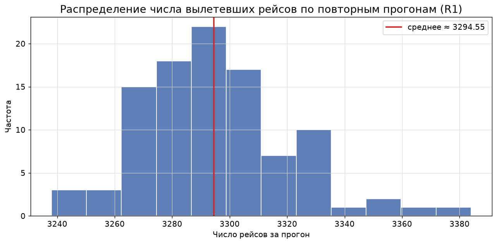

### Рис. 2 — Распределение доли рейсов повышенной ГП R2
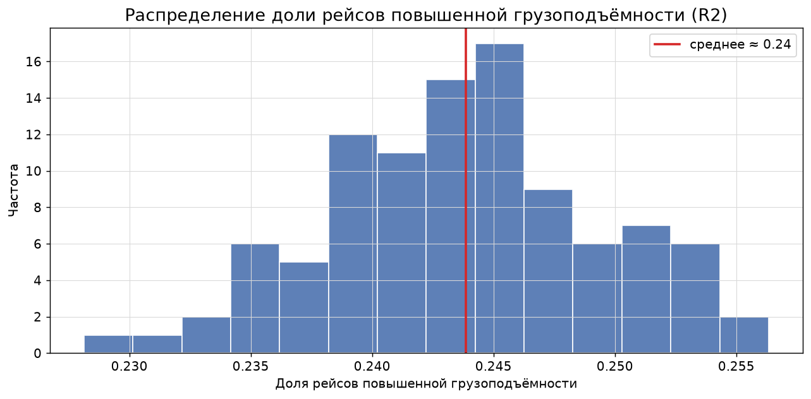

### Рис. 3 — Динамика склада и накопленное число вылетов за прогон (seed=7)
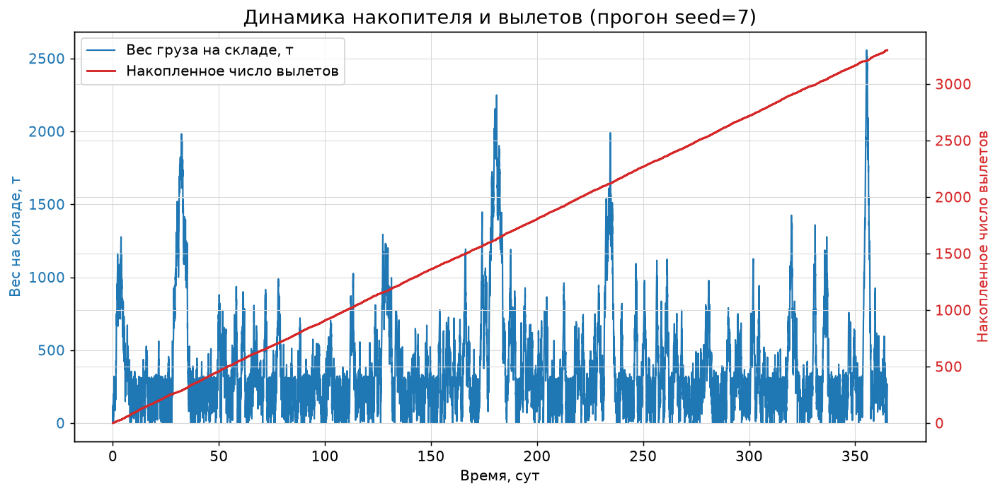

### Рис. 4 — Распределение среднего времени ожидания контейнера R4
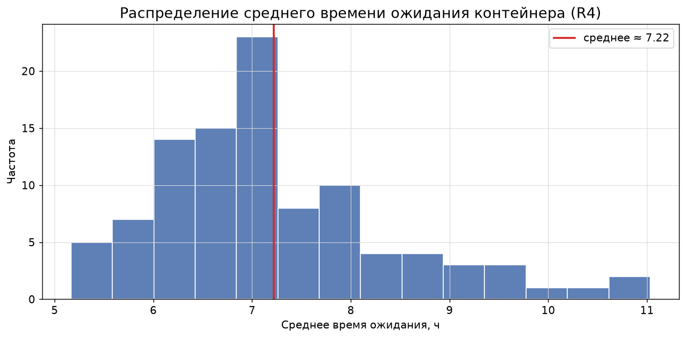

### Рис. 5 — Разброс откликов по повторным прогонам (ящиковые диаграммы)
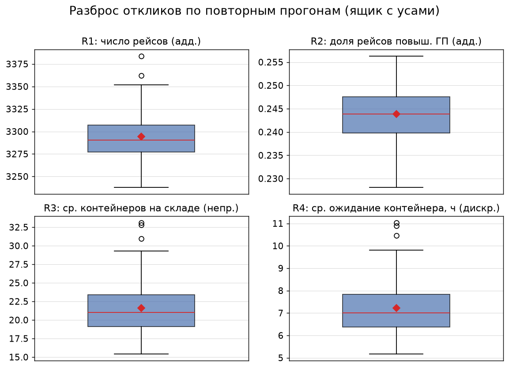

### Рис. 6 — Сходимость оценок откликов при увеличении числа прогонов
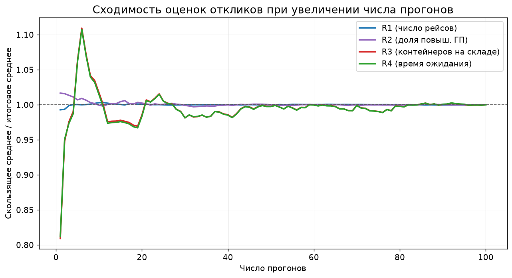

### Рис. 7 — Оценки откликов со 95%-ми доверительными интервалами
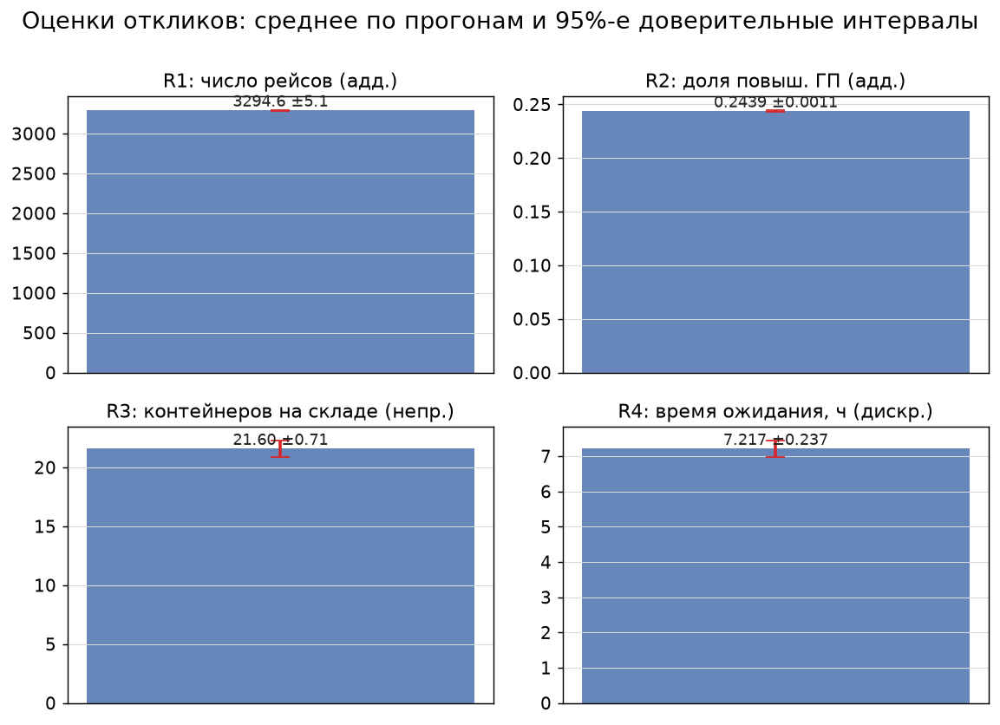

### Рис. 8 — Квазипараллельные процессы: состояния самолётов (первый месяц прогона seed=7)
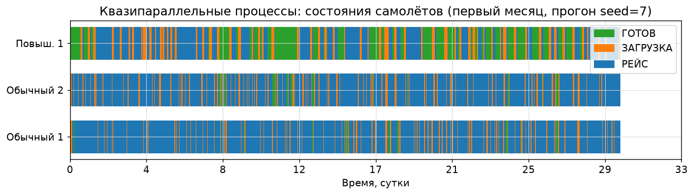

### Рис. 9 — Динамика откликов, базовый режим (реализации + среднее)
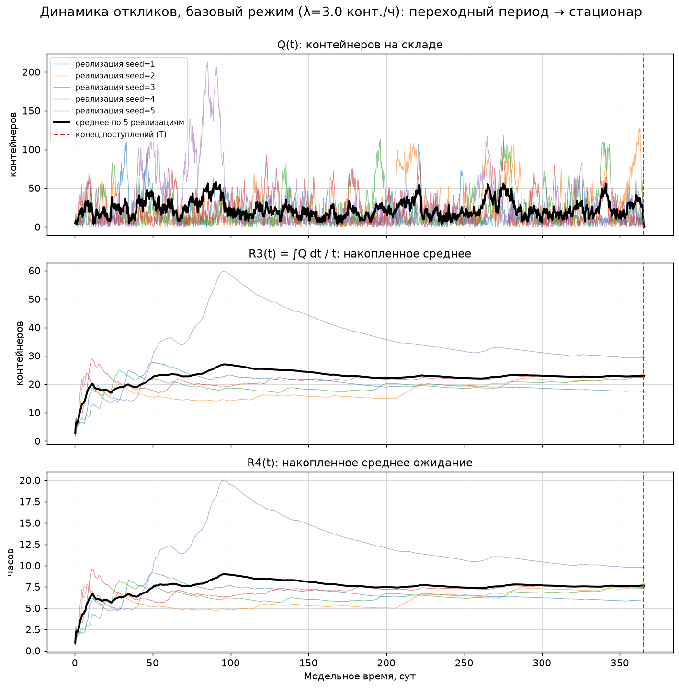

### Рис. 10 — Динамика откликов, режим перегрузки (реализации + среднее)
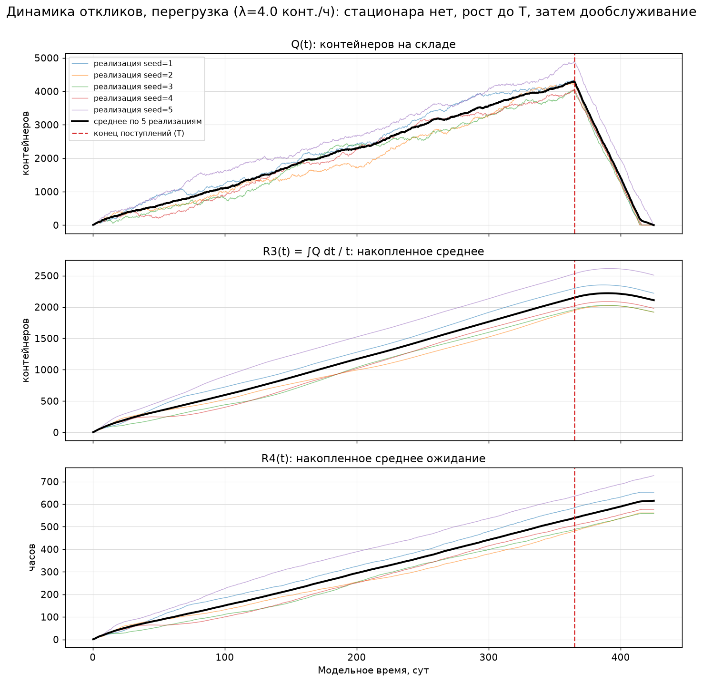

### Рис. 11 — Чувствительность к интенсивности потока λ
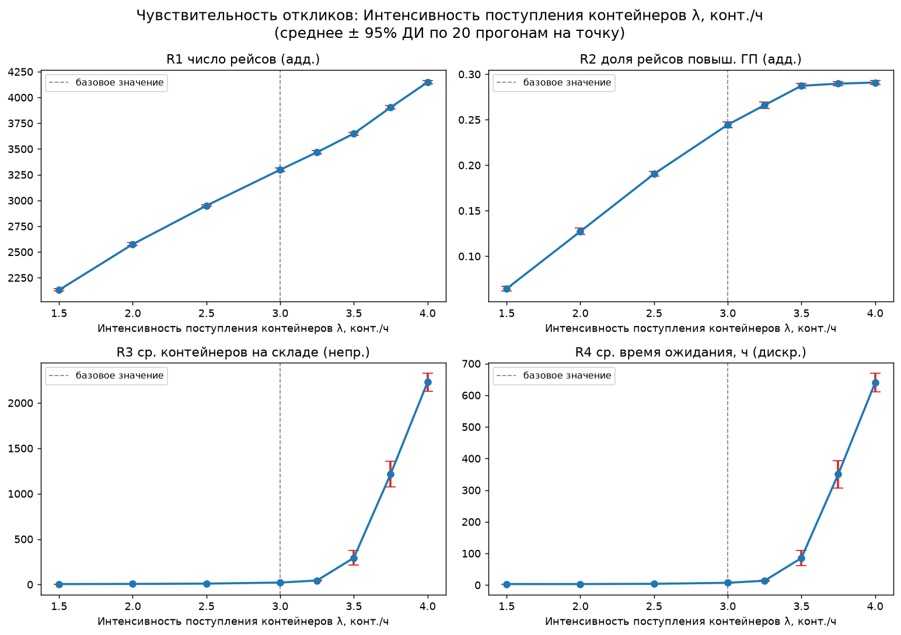

### Рис. 12 — Чувствительность к среднему времени рейса
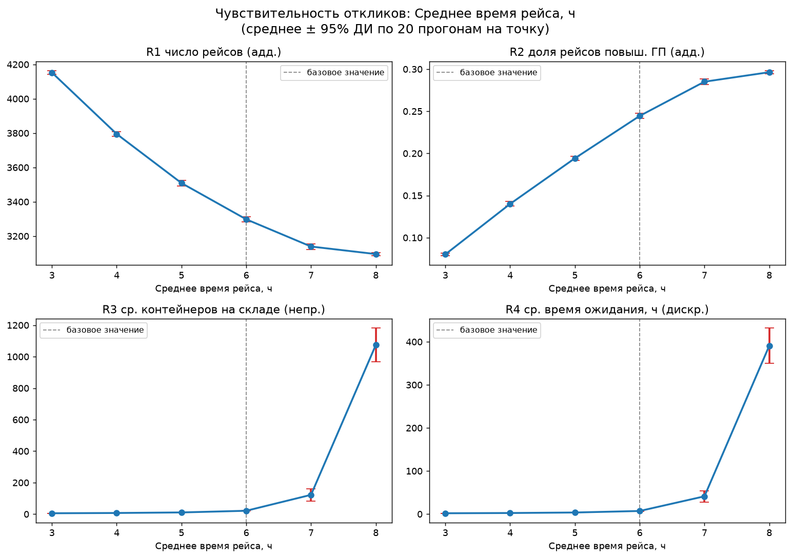

### Рис. 13 — Чувствительность к числу обычных самолётов
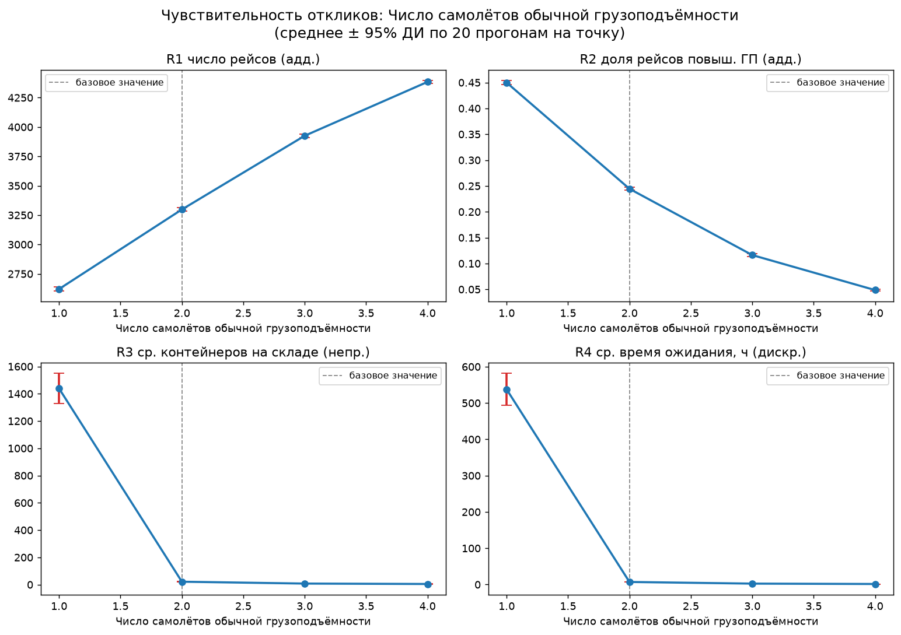

---

## 7. Выводы

1. Модель реализована как дискретно-событийная **без постоянного временного
   шага** на библиотеке SimPy (классы прогона `Run` и серии прогонов
   `Runner`); динамика представлена как взаимодействие квазипараллельных
   процессов-агентов `CONTAINER_FLOW`, `PLANE_i`, `DISPATCHER` с ресурсом
   «склад» (`simpy.Store`).
2. Правило управляющего «обычные самолёты в приоритете» реализовано и
   подтверждено результатами и юнит-тестом: обычные самолёты выполняют ≈ 76 %
   рейсов; повышенная ГП используется только при отсутствии свободных обычных.
3. Верификация по 100 повторным прогонам подтвердила точный материальный
   баланс (~10⁻⁹ т), узкие 95%-е доверительные интервалы всех откликов и
   стабилизацию скользящих оценок.
4. В базовом режиме после переходного периода отклики выходят на стационар; при
   λ = 4 конт./ч система не справляется с нагрузкой — склад растёт по линейному
   тренду до конца поступлений и снижается только на дообслуживании.
5. Анализ чувствительности показал порог пропускной способности ≈ 3.4 конт./ч
   и сильное влияние времени рейса и числа обычных самолётов на R2–R4.
6. Режим трассировки позволяет пошагово проконтролировать состояние объекта
   моделирования (все события, состояния самолётов и склада).

---

## Приложение. Как запустить

```
python -m pip install -r requirements.txt           # simpy, matplotlib
python simulation.py                                # 100 прогонов, отклики в терминал -> out/results_replications.csv
python simulation.py --config config_overload.json  # режим перегрузки
python simulation.py --trace                        # прогон с трассировкой -> out/trace_full.txt
python charts.py                                    # статистики + диаграммы fig1–fig10
python sensitivity.py                               # чувствительность fig11–fig13
python -m unittest tests -v                         # юнит-тесты
```
